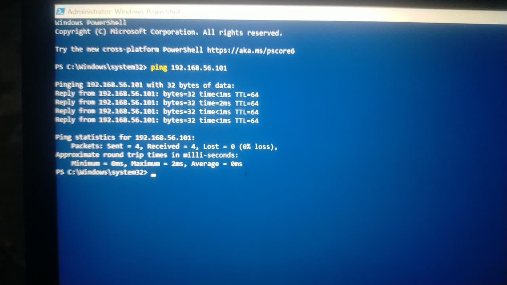

# Build SOC Home Lab (Windows + Ubuntu)

## 1. Project Overview

This project demonstrates the setup of a basic Security Operations Center (SOC) Home Lab using Windows and Ubuntu virtual machines.

The purpose of this lab is to create a controlled environment for practicing network communication, SSH connectivity, system administration, and security log monitoring.

---

## 2. Lab Environment

The lab consists of:

- Windows host machine
- Ubuntu virtual machine
- Oracle VirtualBox
- NAT network for Internet access
- Host-Only network for Windows ↔ Ubuntu communication
- SSH for remote administration and testing

---

## 3. Network Configuration

Two network adapters were configured for the Ubuntu virtual machine.

### Adapter 1 — NAT

- Network Mode: NAT
- Ubuntu IP Address: `10.0.2.15`
- Gateway: `10.0.2.2`
- Purpose: Internet connectivity

The NAT adapter allows Ubuntu to access the Internet without directly exposing the virtual machine to the external network.

### Adapter 2 — Host-Only

- Network Mode: Host-Only Adapter
- Ubuntu IP Address: `192.168.56.101`
- Purpose: Communication between Windows and Ubuntu

The Host-Only adapter provides an isolated network between the Windows host and the Ubuntu virtual machine.

---

## 4. Network Connectivity Test

Windows was used to test connectivity with the Ubuntu virtual machine.

Command:

```powershell
ping 192.168.56.101
````

Result:

* Packets Sent: 4
* Packets Received: 4
* Packets Lost: 0
* Packet Loss: 0%

This confirmed successful Windows → Ubuntu network connectivity.

---

## 5. SSH Configuration

SSH was enabled on the Ubuntu virtual machine.

The SSH service was checked using:

```bash
sudo systemctl status ssh
```

The SSH service was successfully started and became:

`Active: active (running)`

SSH was also verified to be listening on port 22 using:

```bash
sudo ss -tlnp | grep ':22'
```

The output showed that SSH was listening on:

* `0.0.0.0:22`
* `[::]:22`

---

## 6. Windows → Ubuntu SSH Test


The SSH connection was tested from Windows PowerShell using:

```powershell
ssh hamida-majeed@192.168.56.101
```

The connection was successful and Ubuntu displayed its welcome message.

This confirmed that Windows could remotely connect to the Ubuntu virtual machine through SSH.

---

## 7. SSH Port Verification

The SSH port was tested from Windows using:

```powershell
Test-NetConnection 192.168.56.101 -Port 22
```

Result:

`TcpTestSucceeded : True`

This confirmed that TCP port 22 was accessible from Windows to Ubuntu.

---

## 8. SSH Log Monitoring

SSH authentication logs were checked using:

```bash
sudo grep "Accepted" /var/log/auth.log
```

The successful SSH login was recorded in the authentication logs.

The logs showed the successful login of:

`hamida-majeed`

from:

`192.168.56.1`

This demonstrates how a SOC analyst can use authentication logs to identify successful remote access.

---

## 9. Security Observations

During the lab, an incorrect username was also used during an SSH connection attempt.

The failed authentication attempt was recorded in the SSH logs.

This demonstrates an important SOC monitoring scenario:

**Failed login attempts → Successful login**

A SOC analyst can investigate repeated failed authentication attempts and determine whether they are caused by user error, brute-force activity, or unauthorized access attempts.

---

## 10. Evidence / Screenshots

The following screenshots were collected as evidence of the lab configuration and testing:

1. VirtualBox Adapter 1 configured as NAT.
2. VirtualBox Adapter 2 configured as Host-Only Adapter.
3. Ubuntu IP address showing `192.168.56.101`.
4. Windows ping test showing `0% packet loss`.
5. Successful SSH connection from Windows to Ubuntu.
6. SSH port test showing `TcpTestSucceeded : True`.
7. SSH authentication log showing the successful login.

---

## 11. Lab Architecture

```text
                    Internet
                       |
                    NAT Adapter
                    10.0.2.15
                       |
                Ubuntu VM
                       |
              Host-Only Adapter
               192.168.56.101
                       |
                Windows Host
               192.168.56.1
```

The NAT interface provides Internet access, while the Host-Only interface provides isolated communication between the Windows host and Ubuntu VM.

---

## 12. Conclusion

The SOC Home Lab was successfully configured using Windows, Ubuntu, and VirtualBox.

The lab successfully demonstrated:

* Virtual machine networking
* NAT configuration
* Host-Only networking
* Windows ↔ Ubuntu connectivity
* SSH configuration
* SSH port verification
* Remote SSH login
* Authentication log monitoring
* Identification of successful and failed login attempts

This environment can be used for further SOC exercises such as log analysis, attack simulation, detection, monitoring, and incident investigation.

````
